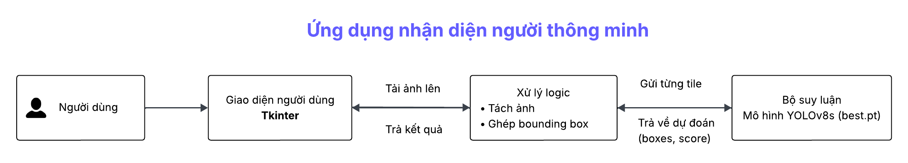
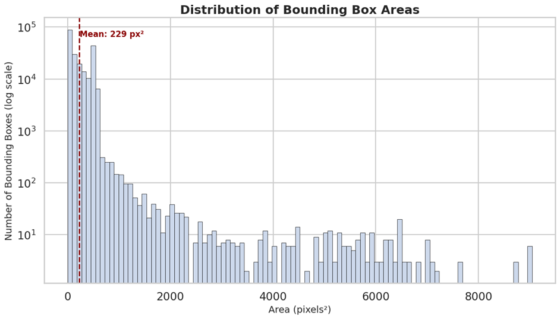
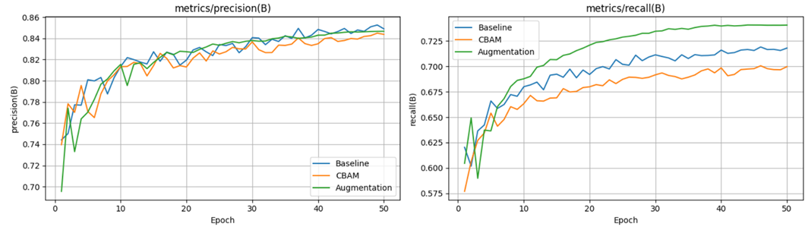
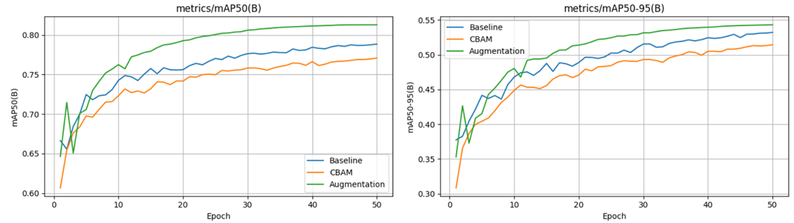
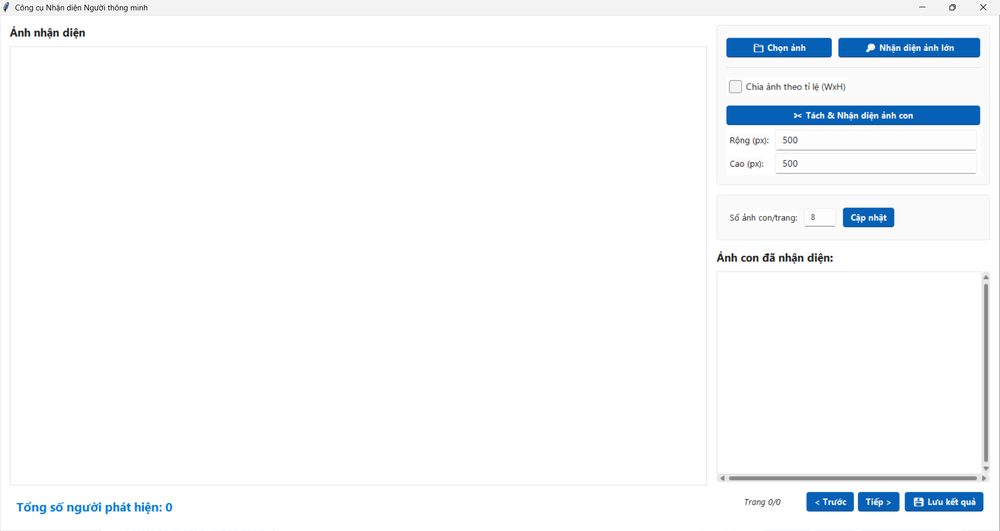
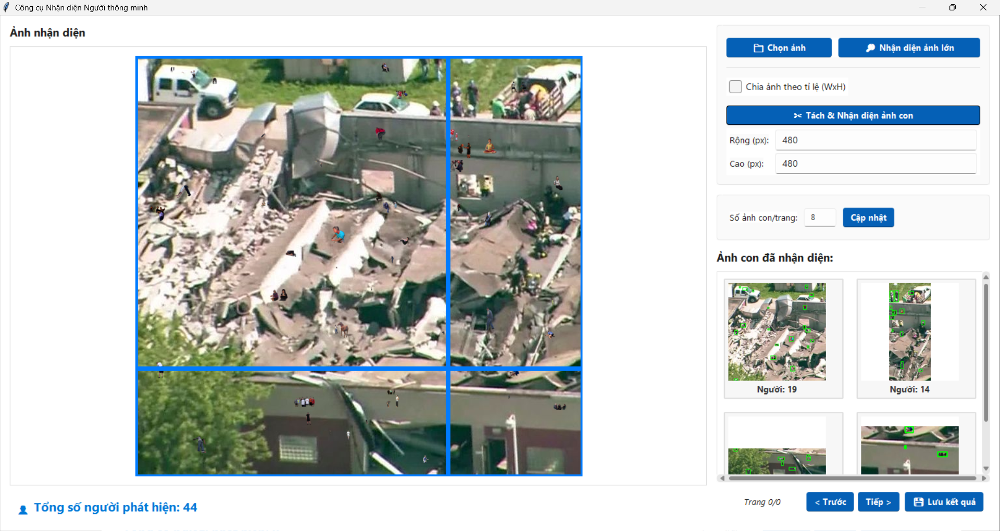
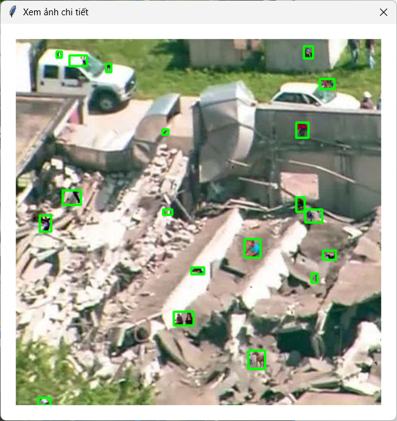
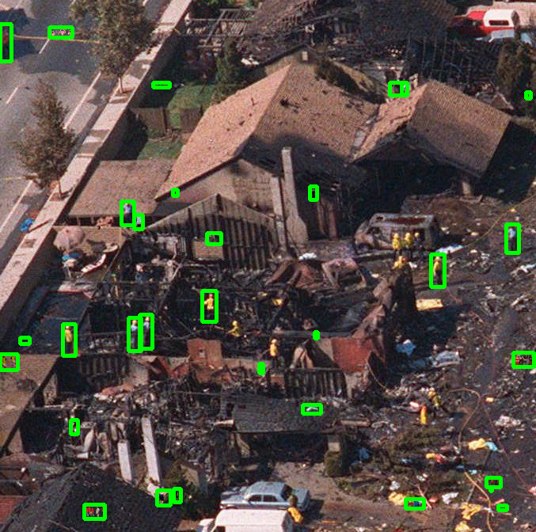

# Hướng dẫn cài đặt và chạy dự án

1. **Tạo môi trường**
```bash
python -m venv .venv
.venv\Scripts\activate
```


2. **Cài đặt ultralytics**
- Vì có một số thay đổi trong source code của YOLO, nên mọi người hãy clone project này về từ github của mình:
```bash
git clone https://github.com/huyvnnb/ultralytics.git
```
- Đổi tên ultralytics thành tên khác, ví dụ ultralytics_custom
```bash
cd ultralytics_custom
pip install -e .
```

**Tại sao lại có phiên bản YOLOv8 tùy chỉnh?**

Thư viện Ultralytics gốc không tích hợp sẵn cơ chế chú ý CBAM. 
Để thêm tính năng này, chúng tôi đã chỉnh sửa trực tiếp mã nguồn của YOLOv8. 
Do đó, việc cài đặt sẽ cần thực hiện từ một repository đã được fork và chỉnh sửa 
thay vì cài đặt trực tiếp từ PyPI.


3. **Chạy và xem kết quả**
- Hãy chỉnh sửa các đường dẫn trong file app/main.py
  - Ảnh ở trong thư mục: app/images/test
  - Model: model/custom/best.pt
  - Kết quả sẽ được show ra ngay lập tức, hoặc bạn có thể lưu vào app/images/result

- Chạy kết quả
```commandline
python run.py
```

## System Design


## Phân tích dữ liệu


# Mô hình huấn luyện



## Demo giao diện




<p align="center">
  
  
</p>
